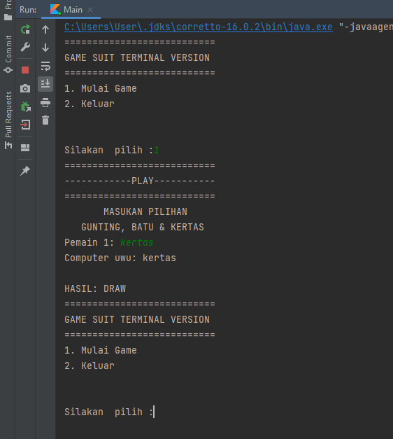

# Rock Paper Scissors Terminal Game

I made a rock paper scissors terminal game with kotlin in IntelliJ IDEA.

Writing code using OOP principles:
- Classes 
- Objects
- Functions & Methods
- encapsulation
- abstraction
- Inheritance
- Constructor
- Properties
- Access Modifiers
- Interface

  

